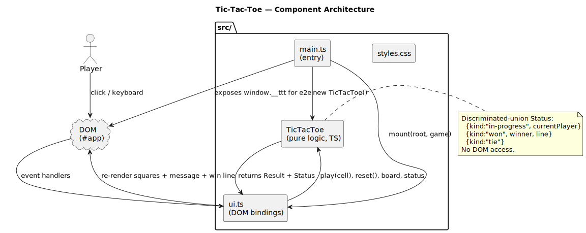
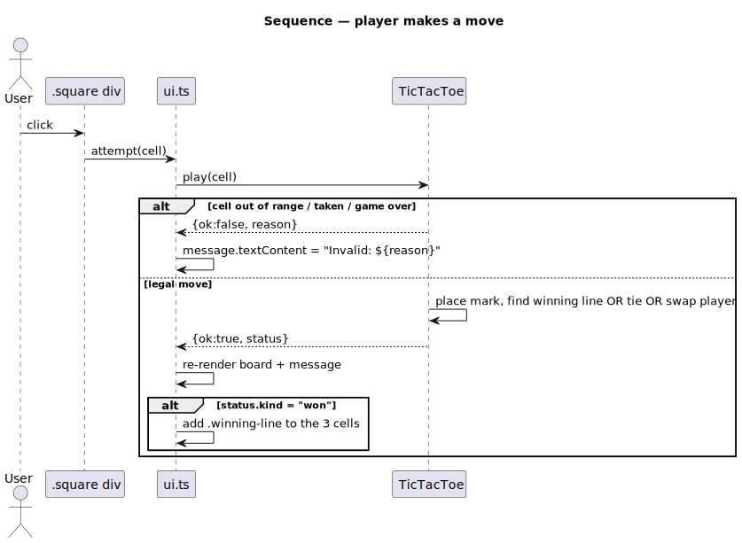
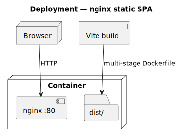

# Tic-Tac-Toe

Browser tic-tac-toe in TypeScript, with a layered separation between pure
game state and DOM bindings.

[](https://github.com/tzone85/tic-tac-toe/actions/workflows/ci.yml)


The original repo had the right tools listed (TypeScript, Playwright, Vitest,
Dockerfile) but nothing wired together — module-level mutable state in
`script.ts`, a Playwright config pointing at `http://google.com/` (a stray
placeholder from a tutorial), the compiled `script.js` committed alongside
the source, and no actual tests on the game class. This rewrite assembles
the parts properly.

## Bugs / smells fixed during the port

| File / area (original)               | Issue                                                                                            |
|--------------------------------------|--------------------------------------------------------------------------------------------------|
| `playwright.config.ts`               | `baseURL: 'http://google.com/'` — placeholder from a Playwright tutorial. Replaced with a real Vite preview server. |
| `src/script.ts`                      | Module-level `let board`, `let currentPlayer`, `let gameState` — untestable; every test imports a frozen state. Extracted to a `TicTacToe` class. |
| `src/script.js`                      | Compiled output committed alongside the source. Removed; Vite handles bundling now. |
| `index.html`                         | Loaded `src/script.js` directly — Vite bundle now serves `src/main.ts`. |
| `src/tests/`                         | Files existed but couldn't run (wrong runner, wrong imports, no config). Replaced with a proper vitest + playwright suite. |
| `Dockerfile`                         | Copied the dev source into `nginx/html` — served unbundled. Now multi-stage: build with node, serve `dist/` with nginx. |

## Architecture

### Components



### Move sequence



### Deployment



Diagrams are PlantUML under `docs/architecture/*.puml`; rendered SVGs are
checked in. Regenerate with `./scripts/render_diagrams.sh`.

## Game state

```ts
type Status =
  | { kind: "in-progress"; currentPlayer: "X" | "O" }
  | { kind: "won"; winner: "X" | "O"; line: [number, number, number] }
  | { kind: "tie" };

class TicTacToe {
  board: readonly (("X" | "O") | null)[];
  status: Status;
  currentPlayer: "X" | "O";
  play(cell: number): { ok: true; status: Status } | { ok: false; reason: string };
  reset(): void;
}
```

The discriminated union means the UI never has to guess what to render —
each `status.kind` maps directly to a render branch.

## Quick start

```bash
npm install
npm run dev          # vite dev server on :5173
npm run build        # produces dist/
npm run preview      # serves dist/ on :4173
npm test             # vitest + 90%/85% gate
npm run test:e2e     # playwright vs preview
npm run lint
npm run typecheck    # tsc --noEmit
```

Container:
```bash
docker build -t tic-tac-toe .
docker run -p 8080:80 tic-tac-toe
```

## Project layout

```
src/
├── main.ts                 # entry — mounts the UI on #app
├── ui.ts                   # DOM wiring (renders, events, keyboard)
├── game.ts                 # PURE: TicTacToe class
└── styles.css
tests/
├── unit/
│   ├── game.test.ts        # 13 tests: legal moves, wins, ties, reset
│   └── ui.test.ts          # 6 tests: render, click, keyboard, reset, win highlight
└── e2e/play.spec.ts        # 4 Playwright flows
docs/architecture/          # PlantUML + SVGs
nginx/default.conf          # SPA fallback for the runtime image
Dockerfile                  # multi-stage build → nginx
.github/workflows/ci.yml
```

## Tests

| Suite                     | Count | What                                                          |
|---------------------------|-------|---------------------------------------------------------------|
| `tests/unit/game.test.ts` | 13    | Start state, legal/illegal moves, win lines, tie, reset       |
| `tests/unit/ui.test.ts`   | 6     | DOM render, click, keyboard, reset button, win-line highlight |
| `tests/e2e/play.spec.ts`  | 4     | Initial load, top-row win, reset, invalid-move feedback       |
| **Total**                 | **23** | 90% line / 85% branch gate on `src/**`                       |

## License

MIT — see [LICENSE](LICENSE).
